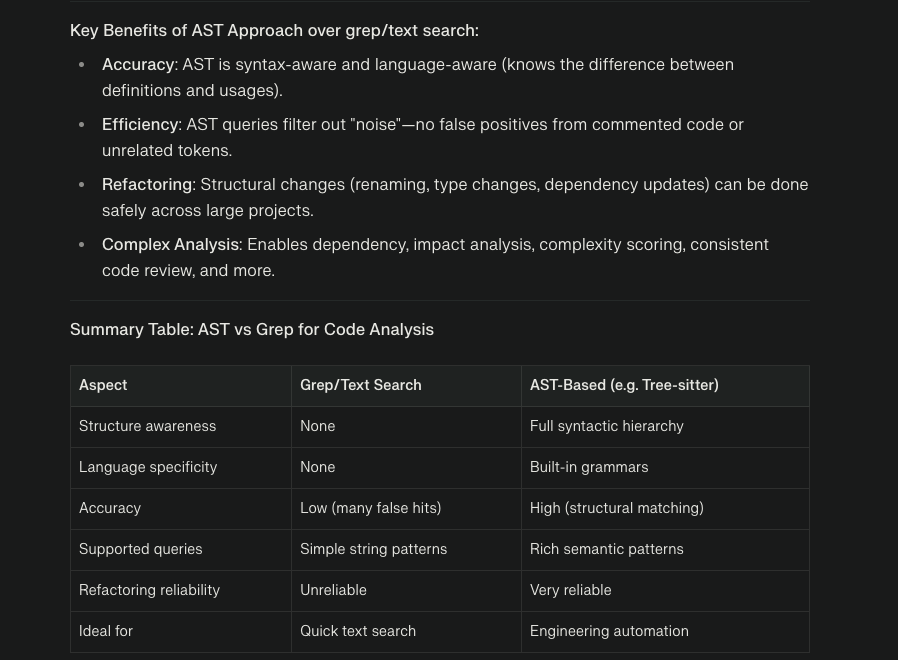

## What is an AST, and how does it help?

* **AST (Abstract Syntax Tree)** is a data structure that represents the hierarchical structure of code. Instead of a string of text, it organizes code into nodes (e.g., functions, variables, statements, blocks), much like a tree.
* **Why it helps:** ASTs allow you (and AI/agents) to query and manipulate code at a higher, meaningful level—finding, for example, all function calls, usages of variables, inheritance relationships, and more. This is much more powerful and structurally accurate than searching for keywords via grep.

## What does AST do in a nutshell?

* Parses code into an organized tree of syntactic constructs (nodes/branches).
* Enables precise structural queries (e.g., "find all classes inheriting from X", "show all return types").
* Powers code refactoring, reviews, semantic search, onboarding, dependency analysis, etc.

